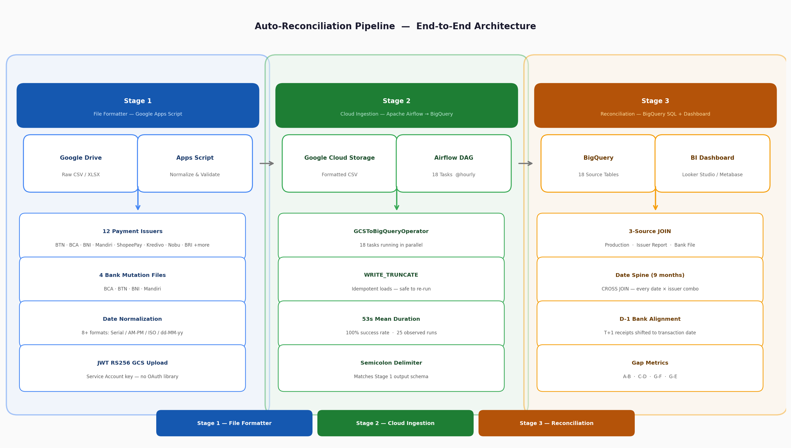

# Auto-Reconciliation Pipeline

> End-to-end automated reconciliation system for payment transactions.
> Covers three stages: **file formatting → cloud ingestion → BigQuery reconciliation + dashboard.**

---

## Architecture Overview



| Stage | Technology | Role |
|---|---|---|
| **Stage 1** | Google Apps Script | Normalize raw CSV/XLSX → upload to GCS |
| **Stage 2** | Apache Airflow + GCSToBigQueryOperator | Load 18 sources from GCS → BigQuery (hourly) |
| **Stage 3** | BigQuery SQL + Looker Studio / Metabase | 3-way reconciliation + gap dashboard |

---

## Problem Statement

Payment issuers and banks send transaction files in inconsistent formats — varying delimiters, date styles, column names, and data types. Without automation:
- Files required manual formatting before each reconciliation run
- Reconciliation between 3 data sources (Production / Issuer / Bank) was done manually
- Discrepancies (missing transactions, amount gaps, unmatched settlements) were hard to surface quickly

This pipeline automates all three stages and surfaces gaps in a BI dashboard refreshed daily.

---

## Stage 1 — File Formatter (Google Apps Script)

**Scripts:** `src/issuer.js`, `src/bank.js`

Reads raw CSV/XLSX files from Google Drive, normalizes each source to a fixed schema, and uploads standardized semicolon-delimited CSV to GCS.

### Supported Sources

**Payment Issuers (12)**

| Issuer | Input | Key Transformations |
|---|---|---|
| BTN | CSV / XLSX | Date/time normalization, RRN zero-padding |
| BCA | CSV / XLSX | AM/PM datetime parsing, numeric reference cleanup |
| BNI | XLSX | Column remapping via header map |
| Mandiri | CSV | Skip metadata rows, date/time split |
| ShopeePay | CSV | Header rename, datetime normalization |
| Indodana | CSV / XLSX | Column whitelist, amount casting, newline sanitization |
| Kredivo | XLSX | Extra column trim, amount casting |
| LinkAja | CSV / XLSX | Checksum footer removal, CSV re-encoding |
| OttoPay | CSV / XLSX | Max-date filename, multi-column datetime fix |
| OttoPay Dashboard | CSV / XLSX | Anti-column-shift for optional `status_invoice` |
| Nobu | XLSX | Approval code zero-padding, MDR % → decimal |
| BRI | CSV / XLSX | 22-column DDL alignment, JAM_TRX/TGL_RK auto-insert |

**Banks (4):** BCA, BTN, BNI, Mandiri — account statement / mutation files

### Key Features
- Auto-detects delimiter (`,` vs `;`) by counting occurrences in the first row
- Handles 8+ date formats including Excel serial numbers, AM/PM timestamps, and 2-digit years
- JWT-authenticated GCS upload using Service Account key (no external OAuth library)
- Anti-column-shift logic: inserts empty placeholder when an optional column is absent
- Structured rolling log buffer (80KB), ready for Telegram/monitoring forwarding
- Weekday schedule (Mon–Fri) with email notification on completion

---

## Stage 2 — Airflow DAG: GCS → BigQuery

**Script:** `src/airflow_dag.py`

An Apache Airflow DAG with **18 parallel `GCSToBigQueryOperator` tasks** — one per source table. Loads formatted CSV files from GCS into BigQuery with schema enforcement.

```
recon_linkaja_mcd              recon_bca_bank_file
recon_linkaja_expansion        recon_bni_bank_file
recon_linkaja_msme             recon_bni_bank_report
recon_indodana                 recon_mandiri_bank_report
recon_kredivo                  recon_mandiri_bank_file
recon_ovo                      recon_bca_issuer_bank_report
recon_shopeepay                recon_btn_bank_mutation_file
recon_ottopay_issuer           recon_btn_issuer_bank_report
recon_ottopay_dashboard        recon_mdr_master
```

| Property | Value |
|---|---|
| Schedule | `@hourly` (every hour) |
| Manual trigger | ✅ Available from Airflow UI |
| Parallelism | All 18 tasks run concurrently |
| Write mode | `WRITE_TRUNCATE` (idempotent) |
| Delimiter | `;` (semicolon, matching Stage 1 output) |
| Auth | `google_cloud_default` GCP connection |

**DAG run stats (as observed):** 25/25 successful runs · Mean duration 53s · Max duration 1m 15s

---

## Stage 3 — Reconciliation SQL + Dashboard

**Script:** `src/recon_summary.sql`

A single BigQuery query that joins all three data sources and computes gap metrics per (date × issuer × merchant segment).

### Data Model

| Column | Label | Description |
|---|---|---|
| `yti_traffic` | **A** | Transaction count — Production system |
| `issuer_traffic` | **B** | Transaction count — Issuer report |
| `yti_trx_amount` | **C** | Gross transaction value — Production |
| `issuer_trx_amount` | **D** | Gross transaction value — Issuer |
| `yti_settlement_amount` | **E** | Net settlement (after MDR) — Production |
| `issuer_settlement_amount` | **F** | Net settlement — Issuer |
| `amount_received` | **G** | Actual money received in bank account |

### Gap Analysis (computed in BI tool)

| Gap | Formula | Purpose |
|---|---|---|
| **A-B** | `yti_traffic - issuer_traffic` | Detect missing or extra transactions |
| **C-D** | `yti_trx_amount - issuer_trx_amount` | Detect amount discrepancies |
| **G-F** | `amount_received - issuer_settlement_amount` | Cash flow vs issuer settlement |
| **G-E** | `amount_received - yti_settlement_amount` | Cash flow vs production settlement |

### Query Design Highlights

- **Date spine (CROSS JOIN)**: generates one row per (date × issuer) for 9 months, ensuring all combinations appear even on zero-transaction days — critical for gap detection
- **Date adjustment**: each issuer has its own settlement cut-off time; transactions crossing midnight are shifted to the correct receival date
- **Merchant categorization**: production transactions are mapped to business segments (MCD / FM / HERO / MSME / Expansion) using merchant master attributes
- **Per-issuer MDR rates**: on/off-us rates are resolved per transaction at query time; no pre-computed MDR table required
- **D-1 bank shift**: bank mutation files report receipts on T+1; the query applies a 1-day back-shift to align with transaction dates
- **UNION ALL pattern**: all 3 sources are unioned into a single flat CTE before the final GROUP BY aggregation

---

## Tech Stack

| Layer | Technology |
|---|---|
| File normalization | Google Apps Script (V8) |
| Source file storage | Google Drive |
| Intermediate storage | Google Cloud Storage |
| Authentication | Service Account + JWT (RS256) |
| XLSX processing | Drive API → Google Sheets |
| Scheduling (formatter) | Apps Script time-based triggers |
| Orchestration | Apache Airflow + `GCSToBigQueryOperator` |
| Data warehouse | Google BigQuery |
| Analytics / Dashboard | Looker Studio / Metabase |

---

## Project Structure

```
auto-recon-formatter/
├── README.md                   ← you are here
├── .gitignore                  ← excludes config.js and credentials
├── config.example.js           ← copy to config.js, fill in your values
└── src/
    ├── issuer.js               ← Stage 1: formatter for 12 payment issuers
    ├── bank.js                 ← Stage 1: formatter for 4 bank mutation files
    ├── airflow_dag.py          ← Stage 2: Airflow DAG (GCS → BigQuery, 18 tasks)
    └── recon_summary.sql       ← Stage 3: BigQuery reconciliation SQL
```

---

## Setup Guide

### Stage 1 — Google Apps Script

1. Open [script.google.com](https://script.google.com) and create a new project
2. Create three files: `config.js`, `issuer.js`, `bank.js`
3. Enable **Drive API**: Services → Drive API → Add
4. Add your Service Account JSON to **Project Settings → Script Properties** (key: `GCS_KEY`)
5. Fill in `config.js` from `config.example.js` (folder IDs, GCS bucket, email)
6. Run `createWeekdayTriggers()` once to set up the Mon–Fri schedule

### Stage 2 — Airflow

1. Copy `airflow_dag.py` to your Airflow DAGs folder
2. Set `BIGQUERY_PROJECT`, `BIGQUERY_DATASET`, `GCS_BUCKET` at the top of the file
3. Ensure a GCP connection named `google_cloud_default` exists in Airflow with BigQuery + GCS permissions
4. The DAG will appear in the Airflow UI and run every hour automatically

### Stage 3 — BigQuery SQL

1. Replace all `your-project-id` and `your_dataset` placeholders with your actual values
2. Replace `YOUR_*` placeholder strings (issuer names, merchant codes, description keywords) with your own business logic
3. Run in BigQuery console or schedule as a BigQuery scheduled query
4. Connect the output table to your BI tool (Looker Studio, Metabase, etc.)

---

## Security Notes

- Service Account credentials are stored in **Script Properties only** — never in source code
- `config.js` is in `.gitignore` to prevent accidental commits
- All BigQuery project IDs and dataset names are parameterized with `YOUR_*` placeholders
- No internal account IDs, referral codes, or merchant identifiers are included in this repo

---

## License

MIT — feel free to adapt for your own reconciliation pipeline.
