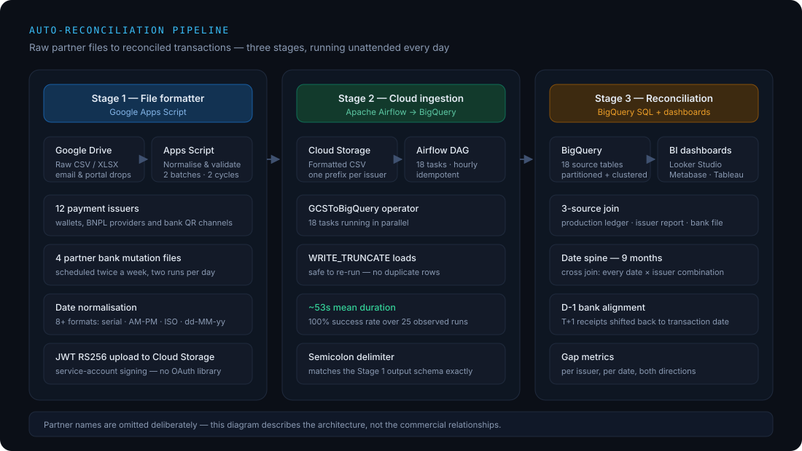
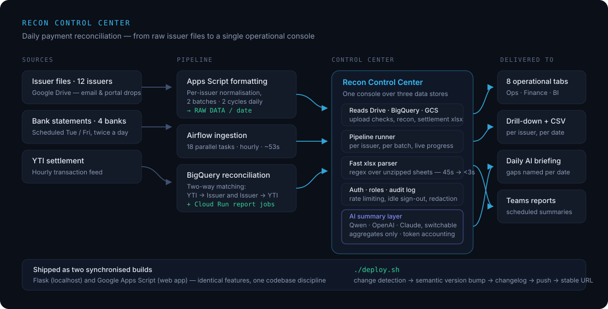

# Auto-Reconciliation Pipeline + Recon Control Center

> End-to-end automated reconciliation for payment transactions — and the operational console built on top of it.
> **Pipeline:** file formatting → cloud ingestion → BigQuery reconciliation.
> **Control Center:** one internal web app where Ops, Finance and BI run and read the whole daily cycle.

**▶ [Try the interactive demo](https://work.indfir.com/demo/recon-control-center/)** — clickable, synthetic data, no sign-in
· [Portfolio](https://work.indfir.com)

> **Note on data.** This repository is a portfolio write-up. Partner names, table names, project IDs
> and figures are generalised or replaced with placeholders. No production credentials, merchant
> identifiers or transaction data are included.

---

## Architecture overview



*Stages 1–3 — the data flow. Stage 4, the Control Center that sits on top, is diagrammed
[further down](#stage-4--recon-control-center).*

| Stage | Technology | Role |
|---|---|---|
| **Stage 1** | Google Apps Script | Normalise raw CSV / XLSX → upload to Cloud Storage |
| **Stage 2** | Apache Airflow + `GCSToBigQueryOperator` | Load 18 sources from Cloud Storage → BigQuery (hourly) |
| **Stage 3** | BigQuery SQL + BI dashboards | 3-way reconciliation + gap metrics |
| **Stage 4** | Apps Script Web App + Flask | Recon Control Center — monitoring, control and AI briefing |

---

## Problem statement

Payment issuers and banks send transaction files in inconsistent formats — varying delimiters, date
styles, column names and data types. Before automation:

- Files needed manual formatting before every reconciliation run
- Matching three sources (production ledger / issuer report / bank file) was done by hand
- Missing transactions, amount gaps and unmatched settlements surfaced late, if at all
- Checking a single day meant opening Drive, BigQuery, Cloud Storage and several spreadsheets

Stages 1–3 automate the data flow. Stage 4 makes it visible and operable without touching the code.

---

## Stage 1 — File formatter (Google Apps Script)

**Scripts:** `src/issuer.js`, `src/bank.js`

Reads raw CSV / XLSX from Google Drive, normalises each source to a fixed schema, and uploads
standardised semicolon-delimited CSV to Cloud Storage.

### Sources covered

**12 payment issuers**, grouped by type rather than named:

| Source type | Count | Input | Representative transformations |
|---|---|---|---|
| Bank QR channels | 4 | CSV / XLSX | Date/time normalisation, reference-number zero-padding, 22-column DDL alignment, auto-insert of missing time/date columns |
| E-wallets | 4 | CSV / XLSX | Checksum footer removal, header rename, CSV re-encoding, multi-column datetime repair |
| BNPL providers | 2 | CSV / XLSX | Column whitelist, amount casting, newline sanitisation inside cells |
| Aggregator dashboards | 2 | CSV / XLSX | Anti-column-shift for an optional status column, max-date filename derivation |

**4 partner banks** — account statement / mutation files.

### Key features

- Auto-detects delimiter (`,` vs `;`) by counting occurrences in the header row
- Handles 8+ date formats: Excel serial numbers, AM/PM timestamps, 2-digit years, `dd-MM-yyyy`, ISO
- JWT-authenticated (RS256) Cloud Storage upload using a service-account key — no external OAuth library
- Anti-column-shift logic: inserts an empty placeholder when an optional column is absent, so
  downstream positions never move
- Structured rolling log buffer (80 KB) ready for forwarding to a monitoring channel
- Weekday schedule with email notification on completion

---

## Stage 2 — Airflow DAG: Cloud Storage → BigQuery

**Script:** `src/airflow_dag.py`

An Airflow DAG with **18 parallel `GCSToBigQueryOperator` tasks** — one per source table — loading
formatted CSV into BigQuery with schema enforcement.

| Property | Value |
|---|---|
| Schedule | `@hourly` |
| Manual trigger | available from the Airflow UI |
| Parallelism | all 18 tasks run concurrently |
| Write mode | `WRITE_TRUNCATE` — idempotent, safe to re-run |
| Delimiter | `;` matching the Stage 1 output schema |
| Auth | `google_cloud_default` GCP connection |

**Observed run stats:** 25 / 25 successful runs · mean duration 53s · max 1m 15s

Target tables follow a single naming convention — `recon_<source>_<file_type>` — one per issuer
report, bank file and the MDR master.

---

## Stage 3 — Reconciliation SQL

**Script:** `src/recon_summary.sql`

One BigQuery query joins all three sources and computes gap metrics per
(date × issuer × merchant segment).

### Data model

| Column | Label | Description |
|---|---|---|
| `core_traffic` | **A** | Transaction count — production ledger |
| `issuer_traffic` | **B** | Transaction count — issuer report |
| `core_trx_amount` | **C** | Gross transaction value — production |
| `issuer_trx_amount` | **D** | Gross transaction value — issuer |
| `core_settlement_amount` | **E** | Net settlement after MDR — production |
| `issuer_settlement_amount` | **F** | Net settlement — issuer |
| `amount_received` | **G** | Money actually received in the bank account |

### Gap analysis

| Gap | Formula | Purpose |
|---|---|---|
| **A−B** | `core_traffic − issuer_traffic` | Missing or extra transactions |
| **C−D** | `core_trx_amount − issuer_trx_amount` | Amount discrepancies |
| **G−F** | `amount_received − issuer_settlement_amount` | Cash flow vs issuer settlement |
| **G−E** | `amount_received − core_settlement_amount` | Cash flow vs production settlement |

### Query design highlights

- **Date spine (CROSS JOIN)** — one row per (date × issuer) for 9 months, so zero-transaction days
  still appear. Without this, a missing file looks identical to a quiet day
- **Per-issuer cut-off** — each issuer settles at a different hour; transactions crossing midnight
  are shifted to the correct receival date
- **Merchant segmentation** — production transactions are mapped to business segments
  (three enterprise chains + an SME segment) using merchant master attributes
- **Per-issuer MDR rates** — on-us / off-us rates resolved per transaction at query time, no
  pre-computed MDR table required
- **D-1 bank shift** — bank mutation files report receipts on T+1; the query shifts them back one day
  to align with transaction dates
- **UNION ALL pattern** — all three sources flattened into one CTE before the final aggregation

---

## Stage 4 — Recon Control Center

The pipeline was reliable, but invisible. The Control Center is an internal web app that puts the
whole daily cycle behind one login.



**▶ [Interactive demo](https://work.indfir.com/demo/recon-control-center/)** (synthetic data)

| Tab | What it does |
|---|---|
| Upload Monitoring | Reads the RAW DATA date folder in Drive and shows which issuer files landed; missing issuers can be re-run per issuer or per batch, with a live progress bar |
| Pipeline | Ordered steps with status and history; admins can trigger any step manually |
| Dashboard Recon | Two-way matching per issuer per date; click any pivot number to drill to the transactions; export match / not-match / all to CSV |
| Report Files | Generated settlement workbooks in Cloud Storage for the last 14 days |
| Data Monitoring | Row counts and amounts per source per date, straight from the warehouse |
| Merchant Balance | Daily merchant settlement snapshot with per-account detail |
| Enterprise | Settlement per enterprise chain, with an expandable not-match breakdown by channel |

### Engineering notes

- **Two synchronised builds.** The same application ships as Flask (localhost) and Google Apps
  Script (hosted web app) — feature-identical, released together.
- **Fast xlsx parsing.** Reading settlement workbooks inside Apps Script took 45 seconds per file
  with DOM parsing. A regex parser over the unzipped sheet XML brought it under 3 seconds.
- **Layered caching keyed on app version**, so a deploy never serves stale numbers.
- **Queued background loading.** Profiling showed the browser locking up when every tab preloaded in
  parallel; work is now queued with idle callbacks.
- **One-command release.** `./deploy.sh` detects what changed, bumps the semantic version, writes the
  changelog, pushes and keeps the same web app URL — no manual step.

### AI briefing layer

Each data tab generates an analyst-style summary in the background: which issuer file is missing
**on which date**, where unmatched volume is concentrated, and who should act — Ops with the issuer
for outbound gaps, Ops with Tech for a production recording gap.

- Provider switchable between three LLM vendors from Settings; each keeps its own key and model
- **Aggregates only** leave the application — never merchant names, account numbers or transaction
  references
- Token usage reported per generation, with a rolling log of the last 50 calls
- Results cached server-side and shared across users, so two people opening the same date do not
  trigger two paid calls

### Security controls

Authentication on every endpoint · SHA-256 password hashing with a server-side salt · lockout after
5 failed sign-ins · 10-minute idle sign-out · server-side role enforcement · secret redaction before
config reaches the browser · 14-day audit log · `Cache-Control: no-store` · aggregate-only AI payloads.

---

## Tech stack

| Layer | Technology |
|---|---|
| File normalisation | Google Apps Script (V8) |
| Source file storage | Google Drive |
| Intermediate storage | Google Cloud Storage |
| Authentication | Service account + JWT (RS256) |
| XLSX processing | Drive API → Google Sheets · regex parser over sheet XML |
| Orchestration | Apache Airflow + `GCSToBigQueryOperator` |
| Data warehouse | Google BigQuery |
| Report jobs | Cloud Run |
| Internal web app | Google Apps Script Web App · Python / Flask |
| Analytics | Looker Studio · Metabase · Tableau |
| Release | clasp + a single deploy script with automatic versioning and changelog |

---

## Project structure

```
auto-reconciliation-pipeline/
├── README.md                   ← you are here
├── .gitignore                  ← excludes config.js and credentials
├── config.example.js           ← copy to config.js, fill in your values
├── pipeline_architecture.svg   ← stages 1–3 architecture
├── control_center_flow.svg     ← stage 4 data flow
└── src/
    ├── issuer.js               ← Stage 1: formatter for 12 payment issuers
    ├── bank.js                 ← Stage 1: formatter for 4 bank mutation files
    ├── airflow_dag.py          ← Stage 2: Airflow DAG (18 parallel tasks)
    └── recon_summary.sql       ← Stage 3: BigQuery reconciliation SQL
```

---

## Setup guide

### Stage 1 — Google Apps Script

1. Create a new project at [script.google.com](https://script.google.com)
2. Create three files: `config.js`, `issuer.js`, `bank.js`
3. Enable the **Drive API**: Services → Drive API → Add
4. Put your service-account JSON in **Project Settings → Script Properties** (key: `GCS_KEY`)
5. Fill in `config.js` from `config.example.js` (folder IDs, bucket, notification email)
6. Run `createWeekdayTriggers()` once to install the schedule

### Stage 2 — Airflow

1. Copy `airflow_dag.py` into your Airflow DAGs folder
2. Set `BIGQUERY_PROJECT`, `BIGQUERY_DATASET` and `GCS_BUCKET` at the top of the file
3. Ensure a `google_cloud_default` connection exists with BigQuery + Cloud Storage permissions
4. The DAG appears in the UI and runs hourly

### Stage 3 — BigQuery SQL

1. Replace every `your-project-id` and `your_dataset` placeholder
2. Replace the `YOUR_*` strings (source names, merchant codes, description keywords) with your own
   business logic
3. Run in the BigQuery console or schedule it
4. Point your BI tool at the output table

---

## Security notes

- Service-account credentials live in **Script Properties only** — never in source
- `config.js` is git-ignored to prevent accidental commits
- Project IDs and dataset names are parameterised with `YOUR_*` placeholders
- No partner names, merchant identifiers, account IDs or production figures appear in this repository

---

## License

MIT — adapt it for your own reconciliation pipeline.
